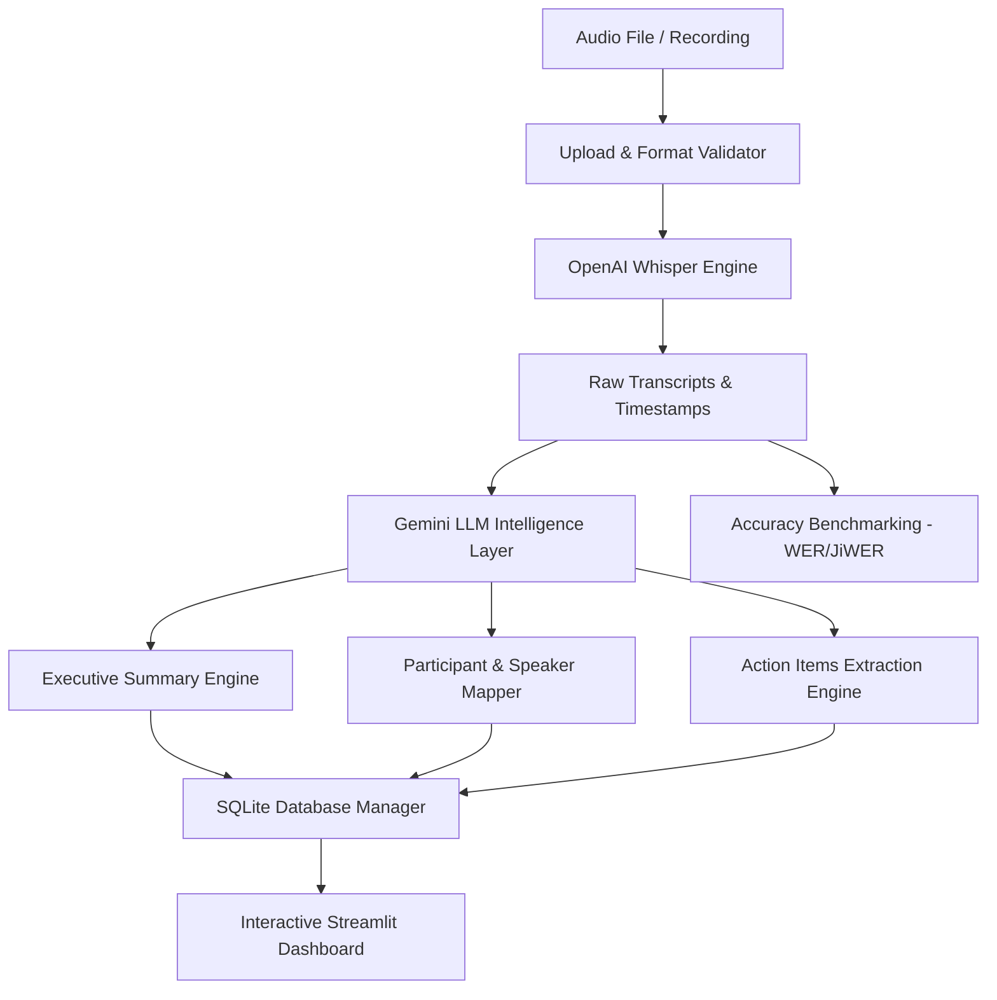

# 🎙️ AI-Powered Meeting Transcription & Intelligence System

[](https://www.python.org/)
[](https://streamlit.io/)
[](https://github.com/openai/whisper)
[](https://ai.google.dev/)
[](https://infyspringboard.onwingspan.com/)

An end-to-end intelligent meeting transcription, summarization, and action-item tracking system developed for the **Infosys Springboard Internship Program**. This application converts multi-speaker audio recordings into highly accurate transcripts using **OpenAI Whisper**, extracts actionable intelligence using **Google Gemini**, and visualizes insights via an interactive **Streamlit** dashboard.

---

## 🚀 Key Features

- **Multi-Format Audio Upload & Validation**: Validates audio duration, sampling rate, channels, and formats (`.mp3`, `.wav`, `.m4a`, `.mp4`).
- **State-of-the-Art Transcription (OpenAI Whisper)**:
  - Flexible model selection (`tiny`, `base`, `small`, `medium`).
  - Word-level and segment-level timestamps.
  - Multi-language support with automatic language detection.
- **AI-Powered Meeting Summarization (Google Gemini)**:
  - Concise Executive Summaries.
  - Discussion key points and critical business decisions.
- **Participant & Speaker Mapping**:
  - Contextual dialogue attribution and speaker identification.
  - Contribution breakdown and speaker engagement analysis.
- **Action Item Extraction & Task Management**:
  - Automated extraction of tasks, owners/assignees, deadlines, and priorities.
  - Interactive status tracking.
- **Accuracy Benchmarking (WER Analysis)**:
  - Quantitative evaluation against ground truth transcripts using Word Error Rate (WER) and Character Error Rate (CER) via **JiWER**.
- **Historical Meetings Archive**:
  - Persistent SQLite storage (`database.py`) allowing quick retrieval, search, and export of past sessions.

---

## 🛠️ Architecture Overview



---

## 📁 Project Structure

```
whisper_project/
├── app.py                   # Main Streamlit web application & UI
├── pipeline_service.py      # End-to-end orchestration pipeline
├── database.py              # SQLite Database manager for meeting archives
├── llm_service.py           # Google Gemini API integration service
├── summarizer.py            # Meeting summarizer module
├── action_engine.py         # Action item extraction & tracking engine
├── participant_mapper.py    # Speaker identification & mapping
├── validate_upload.py       # Audio integrity & format validator
├── validate_transcript.py   # Transcript verification & comparison
├── test_accuracy.py         # Word Error Rate (WER) accuracy benchmark
├── transcribe.py            # CLI-based audio transcription
├── requirements.txt         # Project dependencies
├── .env.example             # Template for required environment variables
└── README.md                # Project documentation
```

---

## 💻 Installation & Setup

### 1. Prerequisites
- **Python 3.9+**
- **FFmpeg**: Required by Whisper for audio decoding.
  - **Windows**: `winget install Gyan.FFmpeg` or download from [ffmpeg.org](https://ffmpeg.org/download.html) and add to PATH.
  - **Linux**: `sudo apt update && sudo apt install ffmpeg`
  - **macOS**: `brew install ffmpeg`

### 2. Clone the Repository
```bash
git clone https://github.com/priyanshu68-1/whisper-transcription1.git
cd whisper-transcription1
```

### 3. Create and Activate a Virtual Environment
```bash
# Windows
python -m venv venv
venv\Scripts\activate

# macOS / Linux
python3 -m venv venv
source venv/bin/activate
```

### 4. Install Dependencies
```bash
pip install -r requirements.txt
```

### 5. Configure Environment Variables
Create a `.env` file in the project root:
```bash
cp .env.example .env
```
Open `.env` and add your Google Gemini API key:
```env
GEMINI_API_KEY=your_actual_gemini_api_key_here
```
> You can generate a free API key at [Google AI Studio](https://aistudio.google.com/).

---

## 🏃 Running the Application

Launch the Streamlit web dashboard:
```bash
streamlit run app.py
```
Open your browser at `http://localhost:8501`.

---

## 📊 Evaluation & Accuracy Testing

You can evaluate the transcription accuracy against ground truth transcripts:
```bash
python test_accuracy.py
```
Calculates **Word Error Rate (WER)** using JiWER to measure model fidelity.

---

## 👥 Contributors & Acknowledgements

- **Developer**: Priyanshu ([@priyanshu68-1](https://github.com/priyanshu68-1))
- **Program**: Infosys Springboard Internship
- **Special Thanks**: Infosys Springboard Mentors & Reviewers
